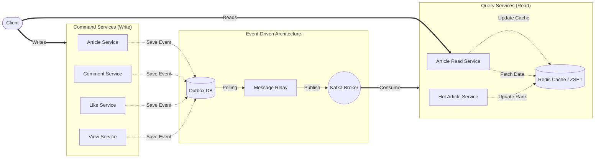

# Notice Board

> **대규모 트래픽과 데이터 분산 처리를 고려한 MSA 기반 이벤트 기반 게시판 시스템**
>
> 단순히 기능을 구현하는 것을 넘어, **분산 환경에서 발생할 수 있는 동시성 이슈, 병목 현상, 그리고 서비스 간 데이터 정합성 문제**를 아키텍처적 및 공학적으로 해결하는 데 초점을 맞춘 프로젝트입니다. 서비스 간 결합도를 낮추고 장애 전파를 격리하기 위해 **마이크로서비스 아키텍처(MSA)**를 채택하였으며, **CQRS 및 이벤트 기반 아키텍처(EDA)**를 통해 대용량 읽기/쓰기 환경에 유연하게 대응하도록 설계했습니다.

<br>

## 시스템 아키텍처



<br>

## Tech Stack

| 분류 | 기술 스택 | 활용 목적 |
| :--- | :--- | :--- |
| **Backend** | Java 21, Spring Boot 3.3.x, Spring AOP, Gradle | 멀티 모듈 기반 도메인 로직 처리 및 AOP 공통 관심사 분리 |
| **Database** | MySQL 8.0, Redis 7.4 | 영속성 데이터 저장소(RDB) 및 캐시/분산 락/인기글 연산 저장소 |
| **Messaging** | Apache Kafka 3.8.0 | 마이크로서비스 간 비동기 이벤트 스트림 및 느슨한 결합 |
| **Architecture** | MSA, CQRS, EDA | 명령(C)/조회(Q) 책임 분리 및 대용량 트래픽 스케일아웃 환경 구축 |

<br>

## 프로젝트 모듈 구조

공통 재사용 라이브러리와 독립적인 마이크로서비스 도메인을 멀티 모듈 형태로 철저하게 분리했습니다.

```text
notice-board
├── common (공통 모듈 라이브러리)
│   ├── snowflake             # 분산 식별자(PK) 생성 모듈
│   ├── data-serializer       # 데이터 직렬화/역직렬화 유틸리티
│   ├── event                 # 마이크로서비스 간 공유 이벤트 객체
│   └── outbox-message-relay  # 트랜잭셔널 아웃박스(Outbox) 연동 메시지 릴레이
└── service (독립 마이크로서비스)
    ├── article               # 게시글 등록/수정/삭제 (Command)
    ├── article-read          # 게시글 목록/상세 조회 (Query - CQRS 최적화 캐시)
    ├── comment               # 계층형 대댓글 관리 (62진수 Path Enumeration)
    ├── like                  # 게시글 좋아요 처리 (동시성 제어)
    ├── view                  # 게시글 조회수 카운팅 (어뷰징 제어)
    └── hot-article           # 실시간 실시간 인기글 랭킹 스트림 처리
```

<br>

## 핵심 엔지니어링 문제 해결 (Troubleshooting)

### 1. 분산 환경 식별자(PK) 생성 전략: Snowflake 알고리즘
- **문제 상황**: 샤딩 환경에서 `AUTO_INCREMENT`는 PK 중복 이슈가 있고, `UUID`는 크기가 비대하며 클러스터드 인덱스 삽입 시 랜덤 I/O로 인한 **B+Tree 페이지 분할(Page Split)**을 유발하여 성능이 급감함.
- **해결 방안**: `[타임스탬프] + [노드 ID] + [시퀀스]` 형태의 64비트 정수형(`BIGINT`) **Snowflake 알고리즘**을 자체 구현하여 도입.
- **결과**: 중앙 코디네이터 없이 분산 환경의 고유성을 확보하고, 시간 순차성 기반의 순차 I/O를 통해 **데이터베이스 삽입 성능을 극대화**함. (저장 공간 최적화: 8 Bytes)

### 2. 무한 Depth 계층형 댓글: 62진수 Path Enumeration 모델
- **문제 상황**: 전통적인 부모-자식 참조 모델은 무거운 재귀 쿼리(`WITH RECURSIVE`)가 발생해 대규모 트래픽에서 데이터베이스 부하가 극심함.
- **해결 방안**: 모든 상위 경로를 문자열로 상속받는 `path` 컬럼을 설계. 데이터 한계 극복을 위해 알파벳 대소문자와 숫자를 혼합한 **62진수(0-9, A-Z, a-z)** 계산 로직을 개발하여 계층당 수억 개의 확장을 지원함.
- **결과**: 신규 등록 시 인덱스 역방향 스캔(Backward Index Scan)으로 `O(1)` 수준의 채번을 달성하고, 조회 시 단순 `ORDER BY path ASC`만으로 정렬된 페이징 데이터를 응답하도록 조회 쿼리 성능을 혁신적으로 개선함.

### 3. 대규모 데이터 페이징 성능 최적화 (`O(N)` ➔ `O(log N)`)
- **문제 인식**
  * 데이터가 수천만 건에 달할 때 일반적인 오프셋 기반 페이징(`LIMIT offset, limit`)을 사용하면 뒤쪽 페이지로 갈수록 앞의 불필요한 행들을 디스크에서 전부 읽고 버려야 하므로 쿼리가 기하급수적으로 느려집니다.

- **해결 방안 및 튜닝**
  * **커버링 인덱스(Covering Index)**: 서브쿼리를 이용해 필요한 식별자(PK) 리스트만 인덱스 트리(메모리) 상에서 고속 필터링한 후, 매칭된 타겟 로우만 메인 테이블과 조인하여 불필요한 디스크 I/O를 완전 차단했습니다.
  * **무한 스크롤(No-Offset)**: 새로 고침이나 신규 글 생성/삭제에 따른 페이징 밀림 현상을 방지하고자, 직전 조회한 데이터의 PK를 기준점으로 잡는 `WHERE id < :last_id` 조건을 적극 채택하여 데이터 규모와 무관하게 `O(log N)`의 일정한 속도로 목록을 반환합니다.


### 4. 동시성 제어 및 어뷰징 방지 전략
- **문제 상황**: 이벤트/게시글 등 다수 사용자가 동시에 "좋아요"를 누르거나, 악의적 매크로가 단기간에 "조회수"를 증폭시키는 갱신 유실(Lost Update) 및 어뷰징 발생.
- **해결 방안**: 
  - 정합성이 생명인 좋아요 기능은 DB **비관적 락(Pessimistic Lock)** 및 **낙관적 락(Optimistic Lock)**을 벤치마킹하여 적용.
  - 조회수 어뷰징 방지를 위해 Redis의 단일 스레드 기반 `setIfAbsent`를 활용한 **분산 락(Distributed Lock)**으로 동일 사용자 접근을 제어.
- **결과**: 동시 요청 폭주 시 데이터 유실률 0% 달성 및 특정 시간 내 비정상적 조작을 원천적으로 블로킹함.

### 5. 트랜잭션 보장형 비동기 통신: Transactional Outbox Pattern
- **문제 상황**: Kafka 비동기 연동 시, 로컬 DB 트랜잭션과 Kafka 발행 로직이 묶여있어 브로커 장애가 발생하면 전체 비즈니스가 롤백(장애 전파)되는 치명적 한계 존재.
- **해결 방안**: 비즈니스 갱신 시 **동일 RDB 트랜잭션 내에서 `Outbox` 테이블에 이벤트를 함께 저장**하고, 별도의 Message Relay 스케줄러가 이를 폴링하여 Kafka에 비동기 전달.
- **결과**: Kafka와 서비스 로직을 완벽히 격리하여 장애 내성을 높이고, **At-Least-Once(최소 1회 전송)** 보장으로 이벤트 유실 불안을 해소함.

### 6. 읽기 부하 분산과 Cache Stampede 방어 (CQRS & Optimized Cache)
- **문제 상황**: 읽기 트래픽 비중이 매우 큰 상황에서, 캐시 데이터 유효기간이 끝나는 짧은 찰나에 조회가 폭주하면 DB로 쿼리가 쏟아지는 **Cache Stampede(Thundering Herd)** 장애 발생 우려.
- **해결 방안**: 
  - **CQRS**: 읽기 전용 서비스(`article-read`)를 구축하고 데이터를 선캐싱.
  - **커스텀 최적화 캐시(`@OptimizedCacheable`) 구현**: 캐시의 **논리적 TTL(유효기간)**과 **물리적 TTL(DB 보관기간)**을 분리하고 **Redis 분산 락**을 결합.
- **결과**: 논리적 만료 시점에 락을 획득한 단 1개의 스레드만 DB를 조회하여 캐시를 리프레시하고, 나머지 대규모 요청 스레드들은 대기 없이 **물리적으로 남은 과거 캐시를 즉시 응답**받아 서버 폭사를 철저하게 방어함.

### 7. Event-Driven 실시간 인기글 스트림 연산 파이프라인
- **문제 상황**: 대규모 배치를 활용해 주기적으로 인기글 순위를 계산하면 트렌드 반영의 실시간성이 떨어지고, 특정 시간에 DB/서버 리소스를 과도하게 소모함.
- **해결 방안**: Kafka 이벤트를 실시간 컨슘해 지속적으로 가중치 점수(`좋아요*3 + 댓글*2 + 조회수*1`)를 계산하는 스트림 파이프라인을 구축. 랭킹 구조로 Redis **Sorted Set(ZSET)**을 채택.
- **결과**: 무거운 배치 연산을 제거하고 이벤트 유입 시점마다 부하를 고르게 분산. 상위 N건의 인기글 랭킹을 **O(log N)** 속도로 즉각 반영 및 초고속 서빙 달성.

<br>

## 로컬 실행 가이드 (Quick Start)

### 1. 인프라 실행 (Docker)
로컬 테스트를 위해 프로젝트 루트의 `docker.sh`를 실행하거나 아래 명령어로 컨테이너를 구동합니다.

```bash
# MySQL 8.0.38
docker run --name notice-board-mysql -e MYSQL_ROOT_PASSWORD=root -d -p 3306:3306 mysql:8.0.38

# Redis 7.4
docker run --name notice-board-redis -d -p 6379:6379 redis:7.4

# Apache Kafka 3.8.0
docker run -d --name notice-board-kafka -p 9092:9092 apache/kafka:3.8.0
```

### 2. Kafka Topic 개설
이벤트 연동 처리를 위해 Kafka 내부 셸에 진입하여 토픽을 파티셔닝하여 생성합니다.

```bash
docker exec --workdir /opt/kafka/bin/ -it notice-board-kafka sh

# 토픽 생성
./kafka-topics.sh --bootstrap-server localhost:9092 --create --topic notice-board-article --replication-factor 1 --partitions 3
./kafka-topics.sh --bootstrap-server localhost:9092 --create --topic notice-board-comment --replication-factor 1 --partitions 3
./kafka-topics.sh --bootstrap-server localhost:9092 --create --topic notice-board-like --replication-factor 1 --partitions 3
./kafka-topics.sh --bootstrap-server localhost:9092 --create --topic notice-board-view --replication-factor 1 --partitions 3
```